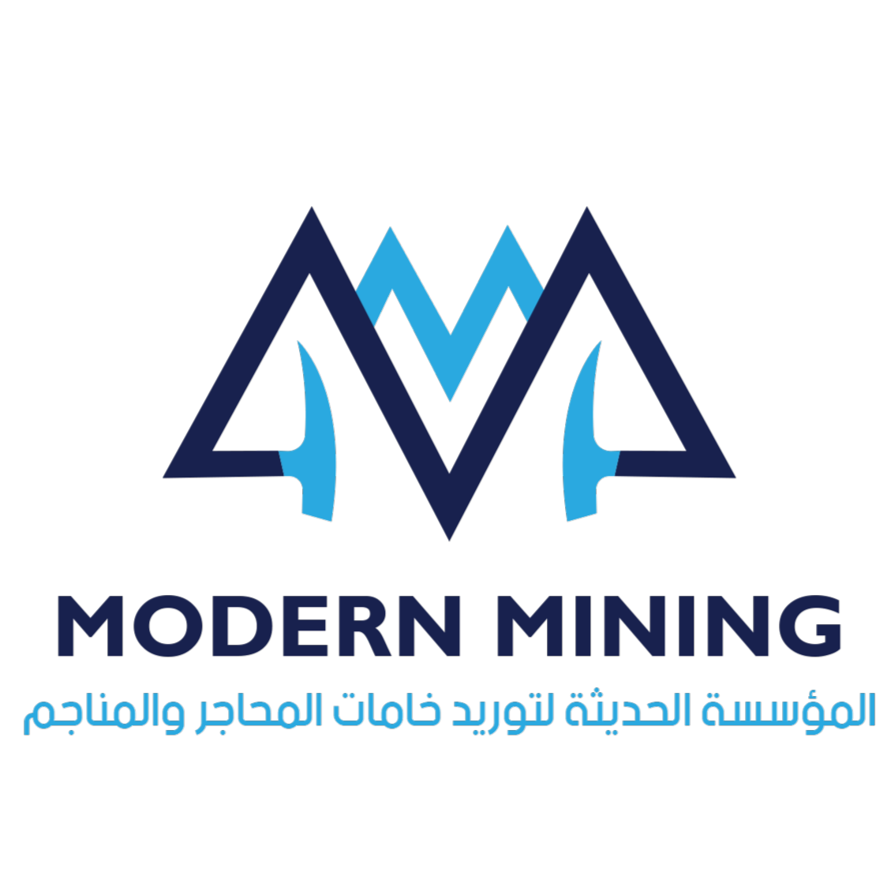

# Modern Mining - المؤسسة الحديثة للتعدين



> **من قلب الأرض... نصنع الجودة**  
> From the Heart of the Earth, We Craft Quality

## 🏔️ About The Project

Modern Mining is a professional, responsive landing website for a mining and raw materials company based in Egypt. The website showcases the company's products, services, and commitment to quality in the mining industry.

### ✨ Features

- 🌐 **Bilingual Support** - Full Arabic (RTL) and English (LTR) language support
- 📱 **Fully Responsive** - Optimized for mobile, tablet, and desktop devices
- 🎨 **Modern Design** - Clean, professional industrial design with gold accents
- ⚡ **Smooth Animations** - AOS and GSAP powered scroll animations
- 🔍 **SEO Optimized** - Semantic HTML structure with meta tags
- 🚀 **Performance Focused** - Lightweight and fast loading
- ♿ **Accessible** - WCAG compliant with proper ARIA labels

## 📁 Project Structure

```
/modern-mining-website
│
├── index.html                 # Main HTML file
│
├── css/
│   ├── bootstrap/
│   │   └── bootstrap.min.css  # Bootstrap framework
│   ├── variables.css          # CSS custom properties
│   ├── styles-ar.css          # Arabic (RTL) styles
│   ├── styles-en.css          # English (LTR) styles
│   └── animations.css         # Animation keyframes
│
├── js/
│   ├── bootstrap/
│   │   └── bootstrap.bundle.min.js
│   ├── scripts.js             # Main JavaScript
│   ├── lang-switcher.js       # Language toggle functionality
│   └── animations.js          # Scroll animations
│
├── assets/
│   ├── images/
│   │   └── modern_mining_logo.png
│   ├── videos/
│   └── icons/
│
├── fonts/
│   ├── Cairo/
│   ├── IBM_Plex_Sans/
│   ├── IBM_Plex_Sans_Arabic/
│   └── Montserrat/
│
└── README.md
```

## 🛠️ Technologies Used

- **HTML5** - Semantic markup
- **CSS3** - Custom properties, Flexbox, Grid
- **JavaScript** - Vanilla ES6+
- **Bootstrap 5** - Grid system and utilities
- **Bootstrap Icons** - Icon library
- **AOS** - Animate on scroll library
- **GSAP** - GreenSock Animation Platform
- **Google Fonts** - Cairo, IBM Plex Sans, Montserrat

## 🚀 Getting Started

### Prerequisites

- Any modern web browser (Chrome, Firefox, Safari, Edge)
- Local web server (optional, for development)

### Installation

1. Clone or download the repository
2. Open `index.html` in your web browser

```bash
# Using a simple HTTP server (Python)
python -m http.server 8000

# Or using Node.js http-server
npx http-server
```

3. Visit `http://localhost:8000` in your browser

## 📦 Products Featured

The website showcases 8 premium mining products:

| Arabic           | English                | Description                              |
| ---------------- | ---------------------- | ---------------------------------------- |
| كرات طحن ألومينا | Alumina Grinding Balls | High-density grinding media for ceramics |
| فلسبار           | Feldspar               | Essential for glass and ceramics         |
| رمل زجاجي مطحون  | Silica Flour           | Fine ground silica for coatings          |
| رمل زجاجي        | Silica Sand            | High-purity glass-grade sand             |
| فلسبار مطحون     | Feldspar Powder        | Ground feldspar for ceramics             |
| زجاج مطحون       | Glass Powder           | Recycled glass for tiles                 |
| فلسبار درجة أولى | High Grade Feldspar    | Premium quality feldspar                 |
| كوارتز           | Quartz                 | High-purity quartz for electronics       |

## 🌍 Browser Support

| Browser | Version         |
| ------- | --------------- |
| Chrome  | Last 2 versions |
| Firefox | Last 2 versions |
| Safari  | Last 2 versions |
| Edge    | Last 2 versions |
| Opera   | Last 2 versions |

## 📱 Responsive Breakpoints

- **Mobile**: < 576px
- **Tablet**: 576px - 991px
- **Desktop**: 992px - 1199px
- **Large Desktop**: ≥ 1200px

## 🎨 Color Palette

| Color             | Hex       | Usage           |
| ----------------- | --------- | --------------- |
| Primary Dark      | `#1a2332` | Main dark color |
| Primary Blue      | `#0d4f8b` | Industrial blue |
| Accent Gold       | `#c9a227` | Premium accents |
| Accent Gold Light | `#e6c547` | Hover states    |
| Neutral White     | `#ffffff` | Backgrounds     |
| Neutral 700       | `#4a5568` | Body text       |

## 🌐 Language Switching

The website supports instant language switching between Arabic and English:

```javascript
// Switch to English
ModernMiningLang.switch("en");

// Switch to Arabic
ModernMiningLang.switch("ar");

// Get current language
ModernMiningLang.getCurrent(); // 'ar' or 'en'
```

## 📧 Contact Information (Placeholder)

- **Address**: 7th Industrial Zone, Sadat City, Menoufia, Egypt
- **Phone**: +20 101 234 5678
- **Email**: info@modernmining.com
- **Working Hours**: Saturday - Thursday: 8 AM - 5 PM

## 🔮 Future Enhancements

- [ ] Backend integration for contact form
- [ ] Product catalog with filtering
- [ ] Customer testimonials section
- [ ] Online quotation system
- [ ] Multi-language CMS integration
- [ ] Dark mode support

## 📄 License

This project is proprietary. All rights reserved to Modern Mining.

## 👥 Credits

- **Design & Development**: Professional Web Development Team
- **Images**: Unsplash (placeholder images)
- **Icons**: Bootstrap Icons
- **Fonts**: Google Fonts

---

<div align="center">

**المؤسسة الحديثة لتوريد خامات المحاجر والمناجم**  
Modern Mining Est.

© 2026 All Rights Reserved

</div>
